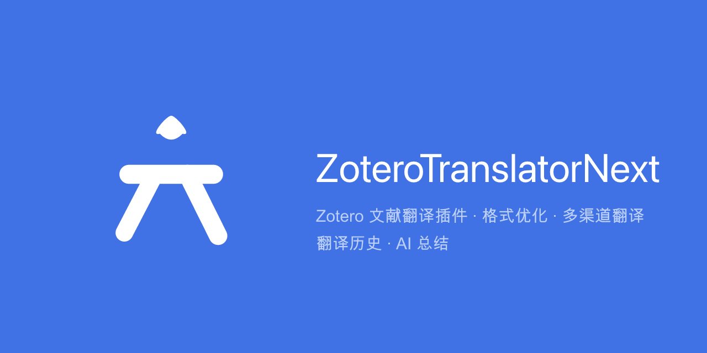

# ZoteroTranslatorNext

<p align="center">
  
</p>

> Zotero 文献翻译插件：**格式优化 + 多渠道翻译 + 翻译历史 + AI 总结**

[](LICENSE)
[](https://github.com/ECHOUniverse/zotero-translator-next/releases/latest)
[](https://www.zotero.org)

[English](./README.en.md) · [方案文档](./Doc/PLAN.md)

## 功能特性

- **划选即译**：PDF 阅读器中选中文本 → 弹层「翻译选中内容」→ 译文显示在侧栏区块
- **规则化格式管线**：翻译前自动做断行合并、连字符断词修复、引号/破折号/全半角/特殊符号正常化（每项可开关，零成本、确定性）
- **多渠道翻译 + 自动回退**：MyMemory（免费免 key）→ DeepSeek → Bing(Azure) → 自定义 OpenAI 兼容渠道；失败按配置顺序自动回退，429 限流指数退避
- **流式体验**：AI 渠道逐字流式输出；翻译队列 + 取消；划选自动翻译（默认关，可调防抖）；LLM 渠道上下文感知
- **翻译历史**：持久化到 Zotero 数据库；全局历史视图（来源条目标注）+ 单条删除 + 清空；相同文本自动命中缓存（可关）
- **AI 总结**：对译文流式总结（复用 AI 渠道，模型/提示词可独立配置），结果可存入历史
- **三段对照**：原文 / 格式化 / 译文对比（可折叠）
- **快捷键**：`Cmd/Ctrl+Shift+T` 翻译、`Cmd/Ctrl+Shift+S` 总结（可自定义、可关闭）
- **双语界面**（Fluent zh-CN / en-US），卡片式现代风格，跟随 Zotero 深浅主题

## 安装

**要求**：Zotero 7 / 8 / 9（manifest 兼容 `6.999 – 9.0.*`）

1. 从 [Releases](https://github.com/ECHOUniverse/zotero-translator-next/releases/latest) 下载 `zotero-translator-next.xpi`
2. Zotero 菜单：**工具 → 插件 → 齿轮图标 → Install Plugin From File…** 选择该 xpi
3. 安装后插件通过 update.json **自动更新**（Help → Check for Updates）

## 快速开始

1. 打开任意 PDF，**划选一段文本**，点击弹出层中的「翻译选中内容」（或按 `Cmd/Ctrl+Shift+T`）
2. 译文流式显示在右侧「翻译」区块；翻译完成后自动写入历史
3. 点击「AI 总结」可对译文生成摘要并存入历史

**默认渠道 MyMemory**（免费、无需配置）。如需更稳定/大量翻译，在设置中配置：

| 渠道         | 配置                   | 说明                                               |
| ------------ | ---------------------- | -------------------------------------------------- |
| MyMemory     | 无需配置               | 免费匿名，单请求 ≤500 字符（自动分块），有日配额   |
| DeepSeek     | API Key                | `https://api.deepseek.com` + `deepseek-chat`，流式 |
| Bing (Azure) | Azure Key + Region     | 官方认知服务，F0 免费层 2M 字符/月                 |
| 自定义       | Base URL + Key + Model | 任意 OpenAI 兼容服务（可多个）                     |

渠道顺序即回退顺序（设置中 ↑↓ 调整）；未配置 key 的渠道自动跳过。

## 快捷键与设置

- 设置入口：**工具 → 插件 → ZoteroTranslatorNext → 首选项**
- 快捷键：点击输入框后直接按键录制
- 格式化规则、历史容量、缓存开关、划选即译/防抖均可配置

## 开发

```bash
npm install
npm run start       # 热重载开发（自动启动 Zotero）
npm run build       # 构建 xpi + 类型检查
npm run test:unit   # 纯函数单测（格式化/分块/语言检测/哈希）
ZOTERO_PLUGIN_ZOTERO_BIN_PATH="/path/to/zotero" npm run test   # Zotero 集成测试
npm run release     # 发布（版本 bump + tag + GitHub Release + update.json）
```

架构：`src/modules/`（格式化/分块/队列/历史/总结）、`src/services/`（渠道抽象 + 回退链）、`src/ui/`（区块 UI，基于官方 `ItemPaneManager.registerSection` API）。

## 隐私

- API key 以明文存储于 Zotero profile 的 prefs.js（Zotero 无加密存储 API）
- 翻译文本会发送至所选第三方服务（MyMemory/DeepSeek/Azure/自定义）
- 历史数据仅存于本地 Zotero 数据库

## License

[AGPL-3.0](./LICENSE)
